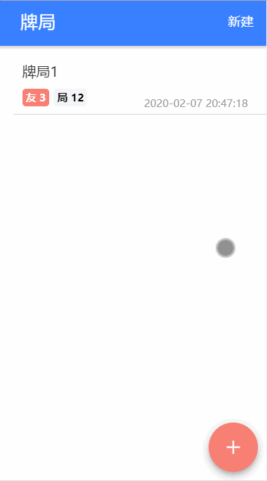

# gamble-recorder

[![build][travis-image]][travis-url]
[![commitizen][commitizen-image]][commitizen-url]
[![prettier][prettier-image]][prettier-url]
[![semantic][semantic-image]][semantic-url]

[travis-image]: https://travis-ci.com/fatesigner/gamble-recorder.svg?color=green&token=i21P7stb8bZPNjZakvsi&branch=master
[travis-url]: https://travis-ci.com/fatesigner/gamble-recorder
[commitizen-image]: https://img.shields.io/badge/commitizen-friendly-green.svg
[commitizen-url]: http://commitizen.github.io/cz-cli/
[prettier-image]: https://img.shields.io/badge/styled_with-prettier-ff69b4.svg?logo=prettier
[prettier-url]: https://github.com/prettier/prettier
[license-image]: https://img.shields.io/badge/License-MIT-green.svg?style=social
[license-url]: https://opensource.org/licenses/MIT
[semantic-image]: https://img.shields.io/badge/%20%20%F0%9F%93%A6%F0%9F%9A%80-semantic--release-e10079.svg?style=flat-square
[semantic-url]: https://opensource.org/licenses/MIT

一个单机版的牌局记录工具，在2020年春节这段非常时期，用于替代传统笔纸的牌局记录。

## 功能
牌局的录入、针对每个牌局的输赢记录的录入，对每个牌局的统计（计分板）。

## demo

APK下载:  https://github.com/fatesigner/gamble-recorder/releases

## 大致细节
使用[@ionic/cli](https://ionicframework.com/docs/cli/)构建的blank模板，Ionic官方提供的组件，使用[@ngrx/store](https://github.com/ngrx/platform)管理数据状态，本地存储使用[@ionic/storage](https://github.com/ionic-team/ionic-storage)，可根据不同的平台选择选择最佳的存储引擎。

## 遇到的问题
1、[hammer.js](http://hammerjs.github.io/getting-started/)添加的长按事件与ionic-content的滚动有冲突，所有绑定该事件的区域均无法滚动。

2、由于使用了@ngrx/store管理数据，所以对于每个页面，通过select获得的data是共享的，即这个data不适合用做输入控件的绑定。否则会引起其他引用了这个data的页面的变化。除非这个变化是在你可控范围内。

## 待完善
1、数据的持久化：当打包为原生APP后，@ionic/storage使用的是SQLite，虽然这个存储相对于localstorage和IndexedDB来说是更稳定的方案。但这些数据脱离了服务端的控制，总觉得有些不妥，这些数据有可能会被删除，也许是用户无意为之，亦是现今手机上所谓的系统清理之流的软件作祟。而数据对于这个应用是根本，虽然这些数据可挖掘和利用的价值不高。所以接下来如果仍不考虑服务端参与的话，后面会添加备份的功能，可导入和导出json文件，而数据结构将会添加版本管理，当应用更新后，结构如果发生变化，可能需要添加转换功能。

2、数据的分享：对于多人参与，一人记录的场景下，可能需要将数据分享给其他人的。这个分享并不是现今的社交分享，而是数据在多终端的同步。而这个功能在没有服务端参与的情况下却是无法实现，这也是单机类应用的弊端。

## 后记
我所能想到的待完善的功能均需要服务端即云端的支持。接下来，也许会添加用户模块、对多种牌局的支持（每种牌局的输赢计算形式不一样）、数据记录的方式（不再是手工点击屏幕输入）。

从另外一个角度来看，可以将这个应用看成是采集线下产生的数据然后将其结构化到云端再产生价值的一个过程。只是对于打牌记录的这些数据来说，可挖掘的价值太低，也许借助于它，你会记得你曾经在线下连赢二十几局，赢得了你爸妈以及兄弟姐妹扔给你的各种家务劳动。也仅此而已了吧。

在我看来，面对已经来临的大数据时代，任何平台和个人只有拥抱互联网，拥抱云端，连接人、设备，让万物从中产生联系，能为更多的人提供服务，带来价值，自己才能产生最大的价值。自设藩篱、囿于“一亩三分地”，待互联网浪潮一次次的卷来，终将会被埋葬于波涛之下。
